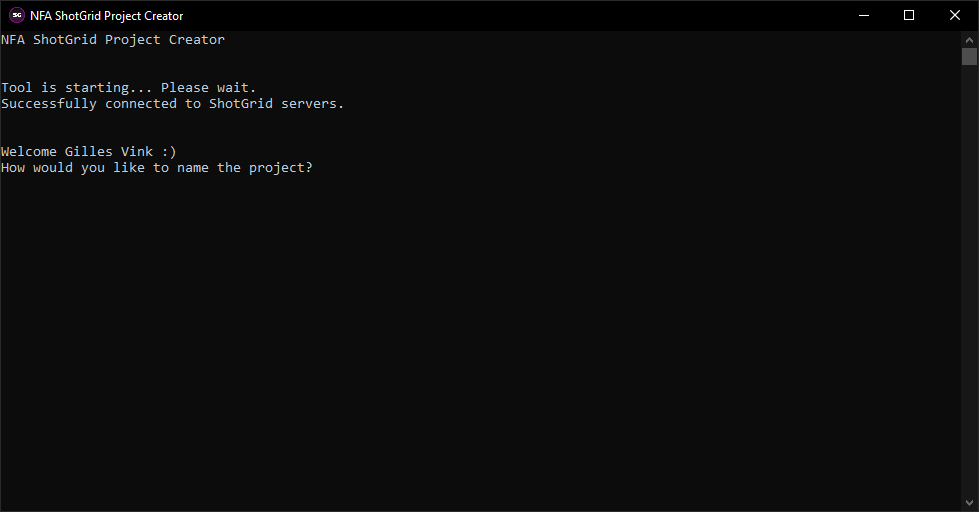

# NFA ShotGrid Project Creation
Command line script to automate ShotGrid project creation for all students at the Netherlands Filmacademy.

While the tool is used, it will ask the student a few questions necessary to create the project.

It will automatically collect the correct pipeline for the student, which will all be validated.
- Project name
- Project code (3 letters)
- Current student year
- Latest corresponding pipeline config (requested from the nfa-shotgun-configuration Github repository)
- Render engine to use (RenderMan/Arnold)
- Project type (documentary, fiction)
- It will allow the student to search other supervisors to add to the project
- It will assign the student the supervision permission group

## How to install

For this script a Windows shortcut is included, change the directory to the correct script location, and set the Python installation to the correct folder.

Although this script can also be used on Mac OS/Linux (tested on Linux).

Make sure to set the credentials in the `ShotGridProjectCreation.py` correctly to an API user with permissions on ShotGrid.

### Required libraries:
- `certifi`
- `charset_normalizer`
- `idna`
- `requests`
- `shotgun_api3`
- `urllib3`

